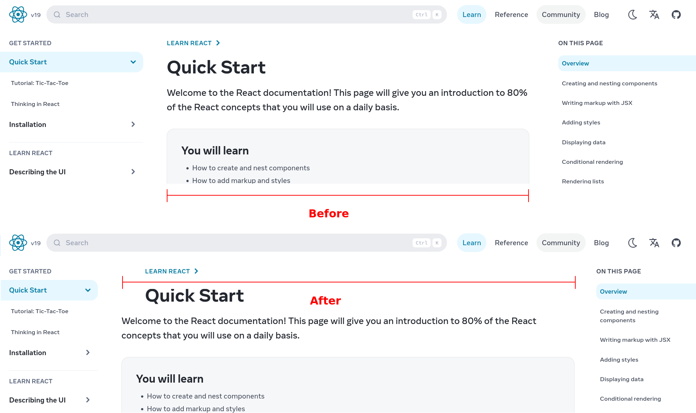

# react.dev more space for content

A user style to give more space for the content on [dev.learn](https://react.dev/).  
Reduces the padding and the size of sidebars on the sides to give more space for the content.

Install from [userstlyles.world](https://userstyles.world/style/20854/react-dev-more-space-for-content) or with the button above.

Use with the [Stylus](https://add0n.com/stylus.html) browser extension.

